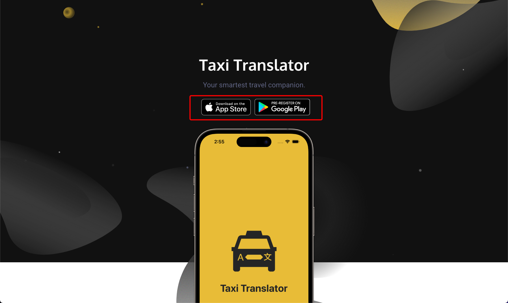
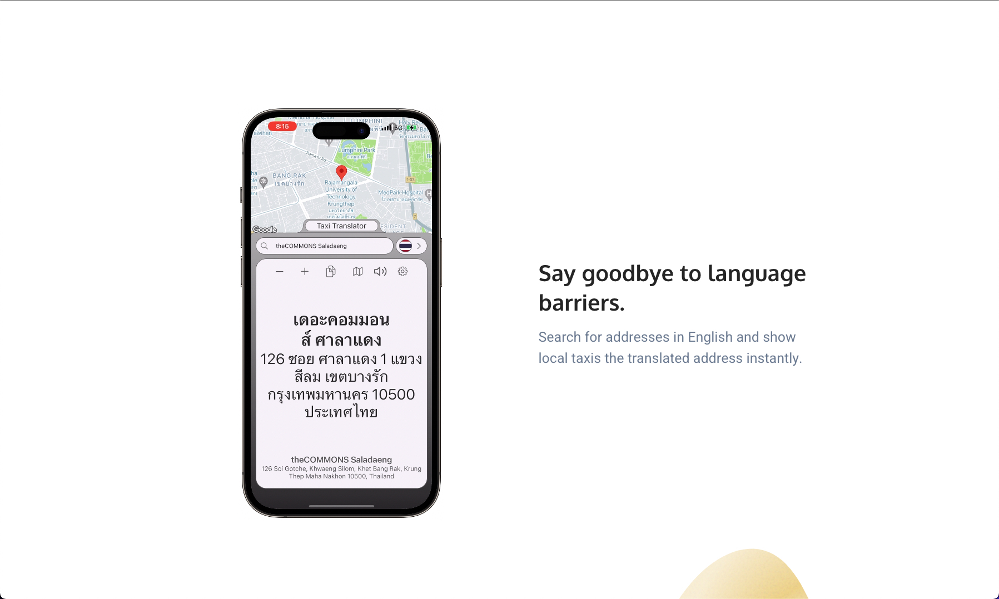
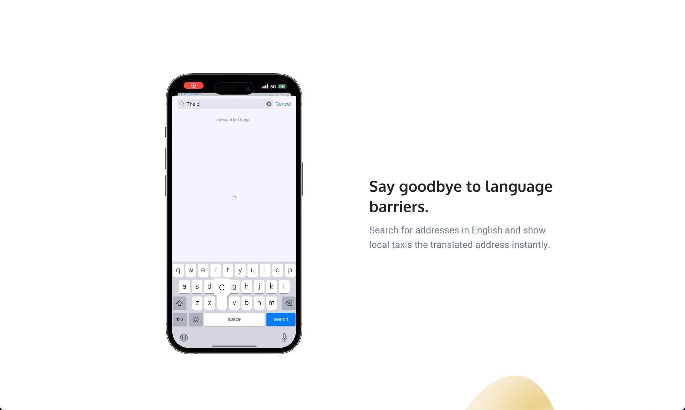
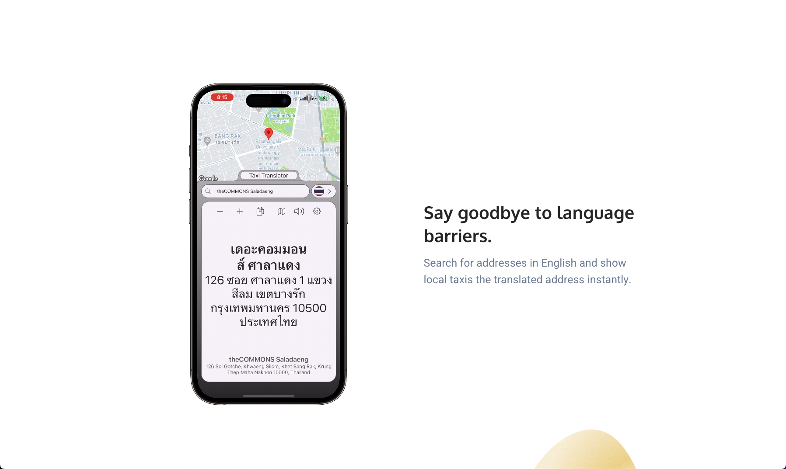
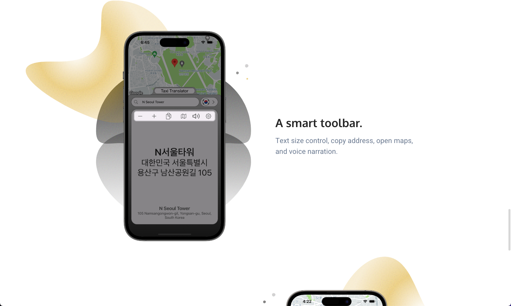

# Taxi Translator Website

**Table of Contents**
- [Introduction](#introduction)
- [Motivation](#motivation)
- [Technology Used](#technologyUsed)
- [Build Status](#buildStatus)
- [Features](#features)

## Introduction 
A full stack website for my taxi translator mobile app. This website provides the value provided by the mobile app to the potential consumer as well as links to both the android and apple store.

LIVE at: <a href="https://taxi-translator.com">taxi-translator.com</a>

## Motivation 
Felt the need to create a website for the taxi translator app. This way I could also have one QR code in advertising materials that users can scan and will direct them to the website where can read more and select which app store to download from.

## Technology Used 
<table>
  <tbody>
    <tr>
      <td>Language</td>
      <td>JavaScript, HTML and CSS</td>
    </tr>
    <tr>
      <td>Database</td>
      <td>Firebase</td>
    </tr>
    <tr>
      <td>Hosting</td>
      <td>Squarespace and Firebase</td>
    </tr>
    <tr>
      <td>Notable Technology Utilized</td>
      <td>
          <ul>
              <li>Responsive web layout</li>
              <li>Firebase posting data</li>
              <li>webm video continually playing</li>     
          </ul>
      </td>
    </tr>
  </tbody>
</table>

## Build Status 
Project is completed.

## Features 
- App store links
- Continually playing video demo
- Information about the app
- Resizable for mobile view

### App Store Links

* User can click either the Android or iOS badge and it will redirect them to those respective app stores to download the Taxi Translator app

### Continually playing video demo

* Video will start playing automatically when the user scrolls down and is on a continous loop
* Video demo is created using final cut pro with an iPhone frame png as one of the layers in the software
* Video is of format WebM so it doesn't take so much storage space and makes the website faster to download

### Information about the app

* User can scroll down the website to read the benefits of the app

### Resizable window

* The web is transformed depending on the screensize it is being viewed on

Alternatively, you may play around with the live web version - https://chi-fact-forum.netlify.app/ 
